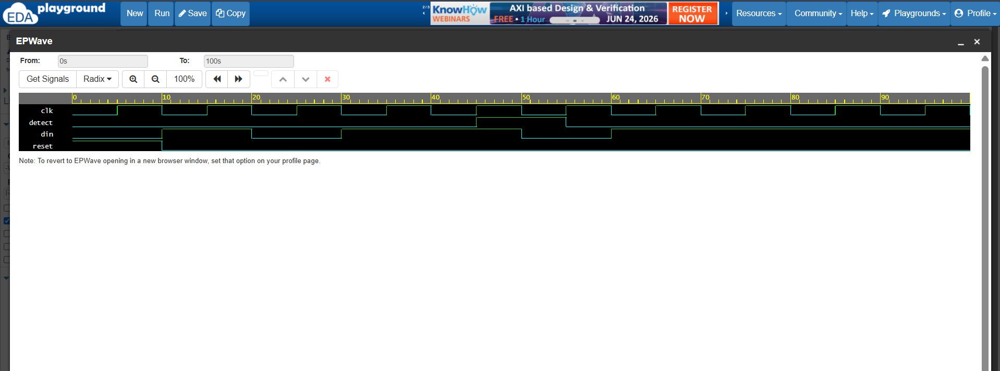
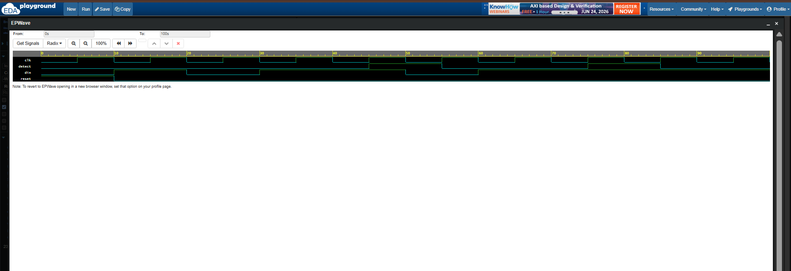

# 🔍 Verilog Sequence Detector (1011)

Implementation of **1011 Sequence Detectors** using **Verilog HDL**, including both **Non-Overlapping** and **Overlapping** Finite State Machine (FSM) designs.

---

## 🚀 Features

✅ Verilog HDL Implementation

✅ FSM-Based Design

✅ Asynchronous RESET Support

✅ Testbench Verification

✅ EPWave Simulation

✅ Waveform Analysis

✅ GitHub Documentation

---

# 📂 Repository Structure

```
Verilog-Sequence-Detector/
│
├── Non_Overlapping_1011/
├── Overlapping_1011/
└── README.md
```

---

# 🔹 Non-Overlapping Sequence Detector

Detects the sequence:

```
1011
```

Once detected, the FSM resets and starts searching again.

## Example

Input:

```
1011011
```

Output:

```
0001000
```

---

## State Transition

| Current State | Input | Next State | Detect |
|---|---:|---|---:|
| S0 | 0 | S0 | 0 |
| S0 | 1 | S1 | 0 |
| S1 | 0 | S2 | 0 |
| S1 | 1 | S1 | 0 |
| S2 | 0 | S0 | 0 |
| S2 | 1 | S3 | 0 |
| S3 | 0 | S2 | 0 |
| S3 | 1 | S0 | 1 |

---

## 📷 Non-Overlapping Waveform



---

# 🔹 Overlapping Sequence Detector

Detects the sequence:

```
1011
```

while reusing previous bits for efficient detection.

## Example

Input:

```
1011011
```

Output:

```
0001001
```

---

## State Transition

| Current State | Input | Next State | Detect |
|---|---:|---|---:|
| S0 | 0 | S0 | 0 |
| S0 | 1 | S1 | 0 |
| S1 | 0 | S2 | 0 |
| S1 | 1 | S1 | 0 |
| S2 | 0 | S0 | 0 |
| S2 | 1 | S3 | 0 |
| S3 | 0 | S2 | 0 |
| S3 | 1 | S1 | 1 |

---

## 📷 Overlapping Waveform



---

# ⚖️ Non-Overlapping vs Overlapping

| Feature | Non-Overlapping | Overlapping |
|---|---|---|
| Reuses Bits | ❌ No | ✅ Yes |
| Detect Efficiency | ⭐⭐⭐ | ⭐⭐⭐⭐⭐ |
| FSM Complexity | ⭐⭐⭐ | ⭐⭐⭐⭐ |
| Interview Importance | ⭐⭐⭐⭐ | ⭐⭐⭐⭐⭐ |

---

# 🛠️ Tools Used

- Verilog HDL
- EDA Playground
- EPWave
- GitHub

---

# 🎯 Learning Outcomes

- FSM Design
- State Transition Modeling
- Sequence Detection
- Overlapping vs Non-Overlapping Concepts
- Testbench Development
- Functional Verification
- Waveform Analysis

---

## ⭐ If you found this project useful, consider giving this repository a star!
